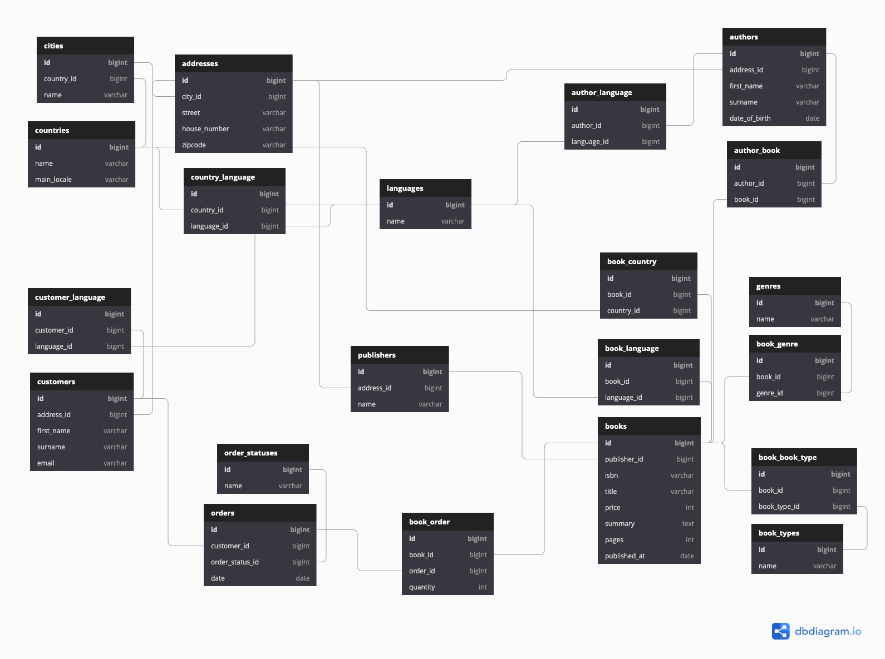

# Bookstore demo

A fictional bookstore, to practise with.

## Installation
Install Composer dependencies.
```sh
composer install
```

Create the .env file (copy of .env.example) and fill it in as usual. Don't forget to set `FAKER_LOCALE` ('en_GB' format).
```sh
cp .env.example .env
```

Generate the application key.
```sh
php artisan key:generate
```

Run migrations and seeders:
```sh
php artisan migrate:fresh --seed
```

## Database diagram


